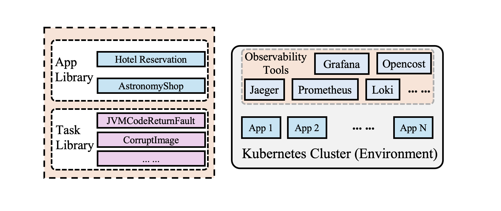

# ITBench for Site Reliability Engineering (SRE) and Financial Operations (FinOps)

**[Paper](#paper) | [Incident Scenarios](./docs/incident_scenarios.md) | [Tools](./docs/tools.md) | [Maintainers](#maintainers)**

## Overview
ITBench uses open source technologies to create completely repeatable and reproducible scenarios on a Kubernetes platform. A scenario involves deploying a set of observability tools, a sample application and triggering an incident (referred to as task) in the environment.


While this repository focuses on scenarios, an open-source Language Model (LM)-based SRE-Agent that aims to diagnose and remediate issues in these scenario environments can be found [here](https://github.com/IBM/itbench-sre-agent). 

### Project Structure

This project uses Ansible to automate the deployment and undeployment of technologies to a Kubernetes cluster and the injection and removal of faults. 
The playbook run is configured using variables defined in `group\_vars`.

| Directory                   | Purpose                                                                                                      |
|-----------------------------|--------------------------------------------------------------------------------------------------------------|
| `roles/observability_tools` | Handles  the deployment and removal of observability tools                                                   |
| `roles/sample_applications` | Handles the deployment and removal of sample applications                                                    |
| `roles/fault_injection`     | Provides reusable fault injection mechanisms                                                                 |
| `roles/fault_removal`       | Provides mechanisms to remove (injected) faults from the environment                                         |
| `roles/incident_`           | Contains scenarios that leverage the fault injection and removal mechanisms defined in the directories above |

## Recommended Software

### MacOS

- [Homebrew](https://brew.sh/)

## Required Software

- [Python3](https://www.python.org/downloads/) (v3.12.Z)
- [Helm](https://helm.sh/docs/intro/install/) (v3.16+)
- [Kubectl](https://kubernetes.io/docs/tasks/tools/)

### Installing Required Software via Homebrew (MacOS)

1. Install [Homebrew](https://brew.sh/)

2. Install required software
```bash
brew install helm
brew install kubectl
brew install python@3.12
```

## Getting Started – Deploying an Incident Scenario

### Installing Dependencies

1. Create a Python virtual environment
```bash
python3.12 -m venv venv
source venv/bin/activate
```

2. Install Python dependencies
```bash
python -m pip install -r requirements.txt
```

3. Install Ansible collections.
```bash
ansible-galaxy install -r requirements.yaml
```

_Note: These steps only need to be done once upon the initial set up._
_Note: Depending on what kind of cluster setup is needed, further dependencies may need to be installed. Please see the below section for further details._

### Cluster Setup

#### Local Cluster

For instruction on how to create a kind cluster, please see the instructions [here](./local_cluster/README.md).

#### Remote Cluster

For instruction on how to create an cloud provider based Kubernetes cluster, please see the instructions [here](./remote_cluster/README.md). 

Currently, only AWS is supported. AWS clusters are provisioned using [kOps](https://kops.sigs.k8s.io/).

### Running the Incident Scenarios

Now that our cluster is up and running, let's proceed with the deployment of the observability tools and application stack, injecting the fault, and monitoring of alerts in the Grafana dashboard.

1. Create the `all.yaml` file from the template and update the `kubeconfig` field with the path to the configuration of the Kubernetes cluster. While the file creation needs only to be done once, the `kubeconfig` field must be updated if the file path changes or the cluster you intend to leverage changes.

```bash
cp group_vars/all.yaml.example group_vars/all.yaml
```

2. Deploy the observability tools. 

```bash
make deploy_observability_stack
```
The observability tools deployment includes Prometheus, Grafana, Loki, Elasticsearch, Jaeger, OpenSearch and K8s-events-exporter. For additional details on the observability tools deployed please head [here](./docs/tools.md).

3. Deploy one of the sample applications. In this case we are deploying OpenTelemetery's Astronomy Shop Demo.

```bash
make deploy_astronomy_shop
```
Currently IT-Bench supports two sample applications--OpenTelemetery's Astronomy Shop Demo and Deathstartbench's Hotel Reservation. For additional details on the sample applications please head [here](./docs/sample_applications.md).

4. Once all pods are running, inject the fault for an incident.

```bash
INCIDENT_NUMBER=1 make inject_incident_fault
```
Currently the incident scenarios open-sourced are incidents 1, 3, 23, 26, 27, and 102. One can leverage any one of these incidents at this point in time in their own environemnts. Additional details on the incident scenarios themselves and the fault mechanisms can be found [here].

5. After fault injection, to view alerts in the grafana dashboard, use Port Forward to access the Grafana service.

```bash
kubectl port-forward svc/ingress-nginx-controller -n ingress-nginx 8080:80
```

6. To view Grafana dashboard in your web browser, use the following URL: 

```bash
http://localhost:8080/prometheus/alerting/list
```

7. In the right panel, under the `Grafana` section, click on the `AstronomyNotifications` folder to view the alerts on the dashboard. Four alerts are defined:
- To track `error` across the different services
- To track `latency` across the different services
- To track status of deployments across the different namespaces
- To track Kafka connection status across the Kafka-related components
An Alert's default `State` is `Normal`. After few minutes, the fault `State` changes to `Firing`, indicating fault manifestation. The alert definitions for Grafana located [here](roles/observability_tools/tasks/alert_rules) and has been curated using this [guide](https://grafana.com/docs/grafana/latest/alerting/alerting-rules/create-grafana-managed-rule/). 

8. (Optional) You only need to do this if you plan to leverage our [SRE-Agent](https://github.com/IBM/itbench-sre-agent). Port forward the topology mapper service by running. 
```bash
kubectl -n kube-system port-forward svc/topology-monitor 8081:8080
```

9. (Optional) You only need to do this if you plan to leverage our [SRE-Agent](https://github.com/IBM/itbench-sre-agent). Leverage the values below for the `.env.tmpl`
```
GRAFANA_URL=http://localhost:8080/prometheus
TOPOLOGY_URL=http://localhost:8081
```

10. To remove the injected fault, run the following `make` command:

```bash
INCIDENT_NUMBER=1 make remove_incident_fault
```
After executing the command, the alert's `State` should change back to `Normal` from `Firing`, indicating that the fault has been removed.

11. Once done you can undeploy the observability, followed by the application stack by running:
```bash
make undeploy_astronomy_shop
make undeploy_observability_stack
```

_Note_: For a full list of `make` commands, run the following command:

```bash
make help
```

## Maintainers
- Mudit Verma - [@mudverma](https://github.com/mudverma)
- Divya Pathak - [@divyapathak24](https://github.com/divyapathak24)
- Felix George - [@fali007](https://github.com/fali007)
- Ting Dai - [@tingdai](https://github.com/tingdai)
- Gerard Vanloo - [@Red-GV](https://github.com/Red-GV)
- Bekir O Turkkan - [@bekiroguzhan](https://github.com/bekiroguzhan)
